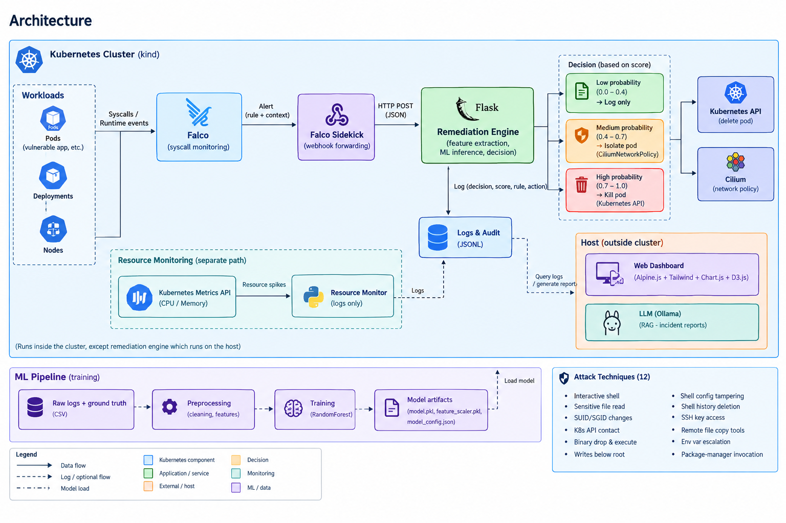

# Autonomous AI-Driven Detection & Remediation for Kubernetes

An internship project exploring whether a Kubernetes cluster can defend itself: watch
runtime behavior, score it with a trained model, and automatically contain a threat —
no human has to click "approve" first.

Falco watches syscalls, a trained classifier decides whether what it's seeing looks like
an attack, and if it does, the engine isolates or kills the offending pod through the
Kubernetes API. End to end, that takes under half a second.

Built during an 8-week internship at Esprit-Cloud (R&D team, ESPRIT — École d'Ingénieurs).


## Architecture



---

## Why this exists

Tools like Falco are great at *detecting* suspicious behavior in a cluster, but they stop
there — they emit an alert and leave the rest to a human. In a real incident, that human
has to notice the alert, figure out what it means, and manually run `kubectl` to do
something about it. That gap is where an attacker's window of opportunity lives.

This project closes that gap. It's not meant to replace a SOC team — it's a
proof-of-concept for the part of the pipeline that currently doesn't exist in most
setups: the part that actually *does something* automatically.

## How it works

```
Falco (syscall monitoring)
   │  matches a rule
   ▼
Falco Sidekick (forwarding)
   │  webhook
   ▼
Remediation Engine (Flask)
   │  rolling 120s window per pod → feature vector
   ▼
RandomForest classifier
   │  attack probability (0–1)
   ▼
Tiered decision
   ├── low probability   → log only
   ├── medium probability → isolate (CiliumNetworkPolicy)
   └── high probability   → kill the pod (Kubernetes API)
```

A second, independent path polls the Kubernetes metrics API for CPU/memory spikes, since
resource-exhaustion attacks don't produce any syscall Falco can see. That path only ever
logs — it never kills anything, by design (see [Design Decisions](#design-decisions)
below).

Every decision — the score, the rule that triggered it, the action taken — gets logged,
both as an audit trail and as the raw data for the benchmark.

## The model: what actually worked (and what didn't)

The first version of this used an **Isolation Forest**, trained unsupervised, since there
was no labeled attack data at the start of the project. It scored 0.25 precision and 0.83
recall — not good.

Digging into *why* turned out to be the most useful part of this project. A quick
diagnostic — labeling windows purely by "did any event happen at all," nothing else — got
1.00 precision and 1.00 recall. The model hadn't learned to detect attacks. It had learned
to detect whether a window was empty. Isolation Forest assumes anomalies are a rare
minority of the data; in this dataset, scored windows are *never* empty (they only get
scored because an alert fired), so that assumption never held.

Once a proper ground-truth pipeline existed — scripted attacks and benign actions, each
logged with exact timestamps, independent of the Falco alert stream — the project switched
to a **RandomForest** classifier instead. That's what's actually deployed now:

| | Precision | Recall | n |
|---|---|---|---|
| Cross-validated (offline, GroupKFold by session) | 0.941 | 0.950 | 251 |
| Live (deployed engine, real attacks, real actions) | 0.953 | 0.938 | 68 |
| Baseline: flag every alert | 0.862 | 1.000 | — |
| Baseline: flag only Critical priority | 0.841 | 0.624 | — |

The offline and live numbers landing close together matters — if the model had just
memorized training data, you'd expect live performance to be noticeably worse. It isn't.

**Caveat worth being upfront about:** both numbers come from deliberately attack-heavy
scripted sessions (~86% attack events). They show the model can tell attack from benign
behavior *within those sessions* — they don't tell you the false-positive rate on a quiet,
mostly idle production cluster. That measurement needs a dedicated benign-traffic
collection run, which didn't happen in this timeframe.

## What it can detect

Twelve attack techniques, covering shell execution, credential access, privilege
escalation, defense evasion, and unauthorized Kubernetes API access:

interactive shell · sensitive file read · SUID/SGID bit changes · K8s API server contact
from a pod · binary drop-and-execute · writes below filesystem root · shell config
tampering · shell history deletion · SSH key access · remote file-copy tooling ·
environment-variable privilege escalation · package-manager invocation

## Defects found along the way

These weren't hypothetical — they all happened live during testing, and each one changed
something in the final design:

- **Container-restart dedup bug** — a pod deleted and recreated with the same name was
  treated as "already handled," silently suppressing a genuinely new attack. Fixed by
  keying state on `(namespace, pod, container_id)` instead of pod name alone.
- **CiliumNetworkPolicy empty-array defect** — `ingress: []` looks like "deny everything"
  if you're used to plain Kubernetes `NetworkPolicy`, but Cilium treats a truly empty array
  as *no rule at all*. The policy existed, matched the pod, and did nothing. Found by
  watching live Hubble flow captures instead of trusting that the policy object existing
  meant it worked. Fix: `[{}]`, not `[]`.
- **The Isolation Forest evaluation** — see above.
- **A container-startup false positive** — a freshly created busybox pod got isolated
  within 3 seconds of creation, because the container runtime unpacking its own binaries
  looked identical to "drop and execute a new binary" to Falco. Fixed with a 10-second
  startup grace period before any isolate/kill action is allowed.
- **A stale-config threshold bug** — during the RandomForest migration, thresholds had
  been temporarily relaxed for safe data collection (so the engine's own kill action
  wouldn't delete test pods mid-session) and were still relaxed during a later benchmark
  run, silently logging everything as `log_only` even at near-certain confidence. Caught
  because the resulting numbers looked implausible, not because anything crashed.

## Repo layout

```
.
├── iac-bundle/
│   ├── setup.sh
│   ├── kind-config.yaml
│   ├── vulnerable-app/
│   └── k8s/
├── remediation-engine/
│   ├── remediation_engine.py
│   ├── features.py
│   ├── model.pkl / feature_scaler.pkl / model_config.json
│   ├── knowledge_base.py
│   ├── incident_summarizer.py
│   ├── ai/
│   └── dashboard.py + dashboard/
├── ml-pipeline/
│   ├── train_model.ipynb
│   ├── training_table_v2.csv
│   └── ground_truth_log.csv
├── webhook-receiver/
├── resource-monitoring/
└── generate_dataset_v6.sh
```

Kubernetes Goat, the second vulnerable application used alongside the custom CloudWatch Lite
app, isn't vendored into this repo — it's deployed separately from
[madhuakula/kubernetes-goat](https://github.com/madhuakula/kubernetes-goat).

## Running it

```bash
cd iac-bundle
bash setup.sh
```

This builds the kind cluster, installs Cilium and Falco (with Sidekick already pointed at
the engine's webhook), and deploys the vulnerable app. Takes a few minutes, mostly image
pulls.

Then, separately (runs on the host, not in-cluster — Falco Sidekick posts to it over the
Docker bridge):

```bash
cd remediation-engine
source venv/bin/activate
python3 remediation_engine.py
```

Try it:

```bash
kubectl port-forward svc/vulnerable-log-viewer 8080:8080
curl "http://localhost:8080/search?q=x;%20cat%20/etc/shadow"
```

Watch `remediation_log.jsonl` for the detection, or check the CiliumNetworkPolicy that
just got created.

## Design decisions

**The LLM never makes decisions.** The incident-report generator runs *after* an action has
already been taken, using retrieval-augmented generation (exact lookups against a small
curated knowledge base — Falco rule descriptions, MITRE ATT&CK references, remediation
policy text) so it can't fabricate details. It has zero influence on detection or
remediation. A security system that has to stay fast and predictable can't have an LLM in
its decision path.

**The DoS/resource-exhaustion path never kills anything.** This is enforced structurally,
not just by configuration — that code has no call path capable of deleting a pod or
creating a network policy. Isolating network traffic doesn't stop a process already eating
local CPU, and killing a Deployment-managed pod just respawns the same problem seconds
later.

**Cilium's own policy object, not generic `NetworkPolicy`.** Using `CiliumNetworkPolicy`
directly means there's no ambiguity about which component is actually enforcing isolation
— which is also what surfaced the empty-array defect above.

## Known limitations

- Precision/recall figures are measured on attack-heavy scripted sessions, not a quiet
  production cluster — real-world false-positive rate is still an open question.
- A single high-confidence event (e.g. one package-manager call) can trigger an immediate
  kill. A corroboration requirement (2+ distinct events) before allowing termination,
  rather than isolation, would be a sensible hardening step before any real deployment.
- System overhead measurement has been inconclusive across repeated trials — likely a
  `kubectl top` sampling-resolution issue rather than genuinely negligible overhead.
  Needs a proper sustained-load test with finer instrumentation.

## Stack

Kubernetes (kind) · Falco · Cilium + Hubble · scikit-learn · Flask · Ollama (Llama 3.2 3B)
· Tailwind CSS / Alpine.js / Chart.js / D3.js for the dashboard

## Acknowledgments

Built at Esprit-Cloud under the supervision of Mrs. Soumaya Mbarek, ESPRIT — École
d'Ingénieurs, Summer 2026.
